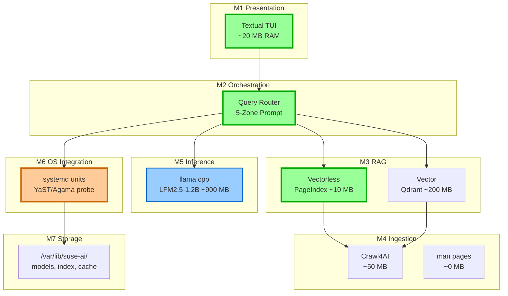
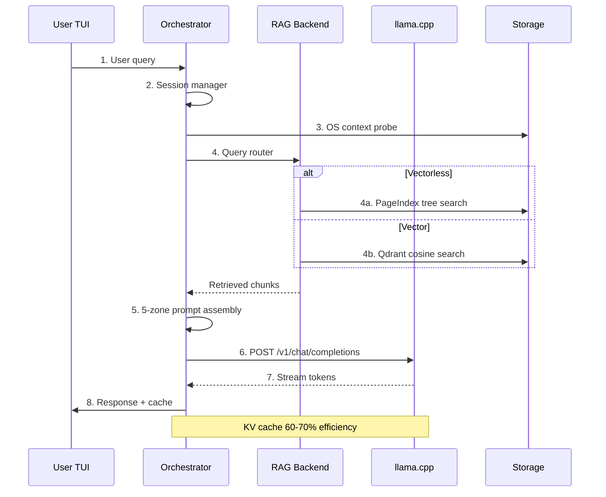

# openSUSE AI Assistant

**Version:** 1.0 (March 2026)  
**Architecture:** v1.0 (11 Sections)  
**Licence:** MIT (code), Apache 2.0 (dependencies)  

---

## 🎯 Project Overview

**Local-first AI assistant for openSUSE Leap** — helps new and experienced users navigate openSUSE with a privately running Small Language Model (SLM) integrated with system lifecycle workflows.

### Key Features

| Feature | Description | Architecture Section |
|---------|-------------|---------------------|
| **100% Local Inference** | No data leaves the machine — air-gapped capable | 
| **Vectorless RAG (PageIndex)** | ~10 MB RAM, 98.7% accuracy on structured docs |
| **Plug-and-Play Architecture** | Swap RAG backends, models, UI via config.yaml | 
| **Podman Rootless** | No root privileges, systemd user services | 
| **Version-Aware** | YaST (Leap 15.x) vs Cockpit/Agama (Leap 16+) |
| **KV Cache Optimization** | 60-70% efficiency gain per query turn | 
| **~1.1 GB RAM Total** | Runs on 4 GB VM with ~530 MB headroom |

---

## 📋 Table of Contents

1. [System Architecture](#system-architecture)
2. [Quick Start (15 minutes)](#quick-start-15-minutes)
3. [Installation Guide](#installation-guide)
4. [Configuration](#configuration)
5. [Usage](#usage)
6. [Project Structure](#project-structure)
7. [Deployment Options](#deployment-options)
8. [Development](#development)
9. [Troubleshooting](#troubleshooting)


---

## 🏗️ System Architecture

### Seven-Layer Architecture 

```

```

### Model Zoo (March 2026) 

| Component | Model | Size | RAM | Purpose |
|-----------|-------|------|-----|---------|
| **Primary SLM** | LFM2.5-1.2B-Instruct Q4_K_M | ~900 MB | ~900 MB | RAG Q&A, commands |
| **Thinking Mode** | LFM2.5-1.2B-Thinking Q4_K_M | ~900 MB | ~900 MB | Complex reasoning |
| **Embedding** | jina-v5-text-nano Q4_K_M | ~120 MB | ~120 MB | Vector RAG only |
| **Upgrade Path** | Qwen3.5-0.8B/2B/4B GGUF | ~500MB-2.3GB | Variable | Better reasoning |

### RAM Budget (4 GB VM) 

```
LFM2.5-1.2B:     900 MB
App + OS:        400 MB
PageIndex Index:  10 MB
Headroom:        530 MB
────────────────────────
Total Used:    ~1.3 GB
Total Available: 4 GB
```

---

## 🚀 Quick Start (15 minutes)

### Prerequisites

```bash
# openSUSE Leap 15.6 or 16.0+
sudo zypper install -y podman podman-docker python3 python3-pip git curl
pip3 install huggingface_hub
```

### One-Line Install

```bash
cd ~/Development && \
git clone https://github.com/YOUR_USERNAME/opensuse-ai-assistant.git && \
cd opensuse-ai-assistant && \
sudo ./scripts/setup_directories.sh && \
./scripts/download_models.sh && \
./scripts/build_podman.sh && \
./scripts/test_llm_connectivity.sh
```

### Start Service

```bash
systemctl --user enable --now pod-suse-ai-pod.service
```

### Access TUI

```bash
# Browser
xdg-open http://localhost:8090

# Or test via API
curl -X POST http://localhost:8080/v1/chat/completions \
    -H "Content-Type: application/json" \
    -d '{
        "model": "local",
        "messages": [
            {"role": "user", "content": "How do I install packages on openSUSE?"}
        ],
        "max_tokens": 200
    }' | jq '.choices[0].message.content'
```

---

## 📦 Installation Guide

### Step 1: Clone Repository

```bash
cd ~/Development
git clone https://github.com/YOUR_USERNAME/opensuse-ai-assistant.git
cd opensuse-ai-assistant
```

### Step 2: Setup Directories

```bash
sudo ./scripts/setup_directories.sh
```

**Creates:**
- `/var/lib/suse-ai/models/` — GGUF files (read-only)
- `/var/lib/suse-ai/index/` — PageIndex JSON trees (~5-20 MB)
- `/var/lib/suse-ai/cache/docs/` — Markdown cache (~100-300 MB)
- `/var/lib/suse-ai/state/` — config.yaml + SQLite (~10 MB)
- `/var/lib/suse-ai/logs/` — Application logs

### Step 3: Download Models

```bash
./scripts/download_models.sh
```

**Downloads:**
- **LFM2.5-1.2B-Instruct-Q4_K_M.gguf** (~900 MB) — Primary SLM
- **jina-v5-text-nano-Q4_K_M.gguf** (~120 MB) — Optional, Vector RAG only

**Manual download:**
```bash
huggingface-cli download LiquidAI/LFM2.5-1.2B-Instruct-GGUF \
    --include "LFM2.5-1.2B-Instruct-Q4_K_M.gguf" \
    --local-dir /var/lib/suse-ai/models/ \
    --local-dir-use-symlinks false
```

### Step 4: Build Podman Image 

```bash
./scripts/build_podman.sh
```

**3-stage build:**
1. **Builder:** Compile llama.cpp (cmake, gcc)
2. **Python:** Install dependencies (crawl4ai, textual)
3. **Runtime:** Minimal image (~500 MB)

### Step 5: Create Podman Pod

```bash
# Create pod with port mappings
podman pod create \
    --name suse-ai-pod \
    --publish 8090:8090 \
    --publish 8080:8080 \
    --publish 8081:8081

# Start LLM container (CPU-only)
podman run -d --pod suse-ai-pod --name llm \
    -v /var/lib/suse-ai/models:/models:ro \
    suse-ai:latest \
    llama-server \
    --model /models/LFM2.5-1.2B-Instruct-Q4_K_M.gguf \
    --port 8080 \
    --n-gpu-layers 0 \
    --threads 4 \
    --mmap \
    --ctx-size 8192

# Start App container (TUI)
podman run -d --pod suse-ai-pod --name app \
    -v /var/lib/suse-ai:/data:rw \
    suse-ai:latest \
    python3 -m src.ui.textual_tui
```

### Step 6: Enable systemd Service 
```bash
# Generate systemd unit
cd ~/.config/systemd/user/
podman generate systemd --new --name suse-ai-pod --files --separator=_

# Enable on login
systemctl --user daemon-reload
systemctl --user enable --now pod-suse-ai-pod.service

# Enable nightly re-index timer
cp ~/Development/opensuse-ai-assistant/deploy/systemd/*.timer ~/.config/systemd/user/
cp ~/Development/opensuse-ai-assistant/deploy/systemd/*.service ~/.config/systemd/user/
systemctl --user enable --now suse-ai-ingest.timer
```

### Step 7: Verify Installation

```bash
# Test LLM connectivity
./scripts/test_llm_connectivity.sh

# Check pod status
podman pod ps --filter "name=suse-ai-pod"

# Check systemd status
systemctl --user status pod-suse-ai-pod.service

# View logs
journalctl --user -u pod-suse-ai-pod.service -f
```

---

## ⚙️ Configuration

### Edit Configuration

```bash
nano /var/lib/suse-ai/state/config.yaml
```

### Vectorless RAG (Default, Recommended) 

```yaml
rag_backend: vectorless
llm_url: http://localhost:8080/v1
llm_model: local
context_size: 8192
temperature: 0.3
max_tokens: 512
```

### Vector RAG (Upgrade Path) 

```yaml
rag_backend: vector
llm_url: http://localhost:8080/v1
embed_url: http://localhost:8081/v1
embed_dim: 768
top_k: 5
```

**Restart after change:**
```bash
systemctl --user restart pod-suse-ai-pod.service
```

### Change Model 

```yaml
# Upgrade to Qwen3.5-0.8B (same RAM, longer context)
llm_model: Qwen3.5-0.8B-Q4_K_M
context_size: 16384
```

**Download new model:**
```bash
huggingface-cli download unsloth/Qwen3.5-0.8B-GGUF \
    --include "Qwen3.5-0.8B-Q4_K_M.gguf" \
    --local-dir /var/lib/suse-ai/models/
```

---

## 💻 Usage

### Textual TUI Commands 

| Key Binding | Action |
|-------------|--------|
| `Ctrl+Q` | Quit application |
| `Ctrl+R` | Reset chat history |
| `Ctrl+O` | Toggle onboarding panel |
| `F1` | Show help |

### Example Queries

```
# Package management
"How do I install Firefox using zypper?"

# System configuration
"What is YaST and how do I use it?"

# Troubleshooting
"Show me failed systemd services"

# Version-aware (Leap 15.x vs 16+)
"How do I configure the firewall?"
```

### Version-Specific Responses 

| Leap Version | Management Tool | Example Response |
|--------------|-----------------|------------------|
| **15.6** | YaST (yast2 commands) | "Use `yast2 firewall` module" |
| **16.0+** | Cockpit (localhost:9090) | "Open Cockpit → Networking → Firewall" |

---

## 📁 Project Structure

```
opensuse-ai-assistant/
├── config/
│   └── config.yaml                      # Main configuration 
├── data/
│   ├── cache/docs/                      # Markdown cache 
│   ├── index/                           # PageIndex JSON trees 
│   ├── models/                          # GGUF model files 
│   └── state/                           # config.yaml + SQLite
├── deploy/
│   ├── cockpit/suse-ai/                 # Cockpit extension Leap 16+ 
│   ├── compose.yaml                     # Podman pod composition 
│   ├── Containerfile                    # Multi-stage build 
│   ├── jeos-firstboot/04_ai_assistant.sh # First-boot module 
│   ├── kubernetes/                      # K8s deployment files
│   ├── podman/                          # Podman systemd units 
│   ├── rancher/                         # Rancher Fleet integration 
│   └── systemd/                         # systemd user services 
├── docs/                                # Documentation
├── scripts/
│   ├── setup_directories.sh             # Create /var/lib/suse-ai/
│   ├── download_models.sh               # huggingface-cli download 
│   ├── build_podman.sh                  # Podman build + pod create 
│   ├── test_llm_connectivity.sh         # API endpoint tests 
│   └── run_firstboot_test.sh            # jeos-firstboot simulation 
├── src/
│   ├── caching/                         # Semantic cache layer 
│   ├── core/
│   │   ├── config_loader.py             # YAML config loading
│   │   ├── interfaces/                  # Plug-and-play contracts
│   │   └── orchestrator.py              # Query router + 5-zone prompt 
│   ├── inference/
│   │   └── llama_client.py              # HTTP client for llama.cpp 
│   ├── ingestion/
│   │   ├── crawl4ai_ingester.py         # HTML→Markdown 
│   │   ├── man_extractor.py             # Local man pages 
│   │   └── zypper_extractor.py          # System state probe 
│   ├── logger/
│   │   └── logger.py                    # Centralized logging
│   ├── os_integration/
│   │   ├── version_detector.py          # YaST vs Agama 
│   │   └── system_context.py            # Live system state 
│   ├── rag/
│   │   ├── vectorless/                  # PageIndex Vectorless RAG
│   │   │   ├── backend.py
│   │   │   ├── tree_builder.py
│   │   │   ├── tree_searcher.py
│   │   │   └── page_fetcher.py
│   │   └── vector/                      # Vector RAG placeholder 
│   └── ui/
│       ├── textual_tui.py               # Main TUI app 
│       └── widgets/
│           ├── chat_panel.py            # Streaming chat 
│           ├── status_bar.py            # Token budget display 
│           └── onboarding_panel.py      # First-boot topics 
├── tests/
│   ├── test_week1.py                    # Week 1 foundation tests
│   └── test_vectorless_rag.py           # Vectorless RAG tests 
├── LICENSE
├── pyproject.toml
├── README.md
└── requirements.txt
```

---

## 🚢 Deployment Options

### 1. Podman Rootless (Default) 

```bash
cd deploy/podman/
./suse-ai.container
systemctl --user enable --now suse-ai.service
```

### 2. Docker (Alternative)

```bash
cd deploy/docker/
docker-compose up -d
```

### 3. Kubernetes 

```bash
cd deploy/kubernetes/
kubectl apply -f k8s-namespace.yaml
kubectl apply -f k8s-deployment.yaml
kubectl apply -f k8s-service.yaml
```

### 4. Cockpit Extension (Leap 16+)

```bash
sudo cp -r deploy/cockpit/suse-ai /usr/share/cockpit/
# Access: http://localhost:9090/suse-ai/
```

### 5. jeos-firstboot (First-Boot) 

```bash
sudo cp deploy/jeos-firstboot/04_ai_assistant.sh /var/lib/jeos-firstboot/modules/
# Runs automatically on first reboot after installation
```

### 6. Rancher Fleet (Multi-Cluster) 

```bash
cd deploy/rancher/
./install-rancher.sh
kubectl apply -f fleet-gitrepo.yaml
```

---

## 🛠️ Development

### Setup Development Environment

```bash
# Create virtual environment
python3 -m venv .venv
source .venv/bin/activate

# Install dependencies
pip install -r requirements.txt

# Install pre-commit hooks
pre-commit install

# Run tests
pytest tests/ -v
```

### Pre-Commit Hooks

```bash
# Run all hooks
pre-commit run --all-files

# Fix trailing whitespace
pre-commit run trailing-whitespace --all-files

# Validate YAML
pre-commit run check-yaml --all-files

# Run linter
pre-commit run ruff --all-files
```

### Run Tests

```bash
# Week 1 foundation tests
pytest tests/test_week1.py -v

# Vectorless RAG tests
pytest tests/test_vectorless_rag.py -v

# All tests with coverage
pytest tests/ -v --cov=src --cov-report=term-missing
```

---

## 🔧 Troubleshooting

### Common Issues

| Issue | Solution |
|-------|----------|
| **Podman pod fails to start** | `podman pod rm -f suse-ai-pod` then `./scripts/build_podman.sh` |
| **LLM server not responding** | `podman container restart llm` then `sleep 10` |
| **Permission denied on /var/lib/suse-ai** | `sudo chown -R $USER:$USER /var/lib/suse-ai` |
| **systemd service not starting** | `systemctl --user daemon-reload` then `systemctl --user restart pod-suse-ai-pod.service` |
| **Model download fails** | `huggingface-cli login` then retry download |

### Debug Commands 

```bash
# Check pod status
podman pod ps --filter "name=suse-ai-pod"

# View container logs
podman container logs llm --tail 50
podman container logs app --tail 50

# Check systemd status
systemctl --user status pod-suse-ai-pod.service
journalctl --user -u pod-suse-ai-pod.service -n 50

# Test API endpoints
curl http://localhost:8080/v1/models
curl http://localhost:8081/v1/models  # Vector RAG only
curl http://localhost:8090

# Check resource usage
podman stats suse-ai-pod --no-stream
du -sh /var/lib/suse-ai/*
```

### Check Version Detection

```bash
# Detect openSUSE version
python3 -c "
import re
with open('/etc/os-release') as f:
    d = dict(re.findall(r'(\w+)=\"?([^\n\"]+)', f.read()))
vid = d.get('VERSION_ID', 'tumbleweed')
corpus = 'yast' if vid.startswith('15.') else 'agama'
print(f'Version: {vid}, Corpus: {corpus}')
"

# Check YaST presence
which yast2 && echo "YaST present"

# Check Cockpit status
systemctl is-enabled cockpit.socket && echo "Cockpit enabled"
```

---


## 📖 References

### Architecture Documentation

- **Architecture v1.0** (March 2026) —
- **Section 1:** Combined System Architecture Overview
- **Section 2:** 2026 Model Zoo — SLMs and Embedding Models
- **Section 3:** Context Engineering and KV Cache Strategy
- **Section 4:** Ingestion Pipeline — All Tools and Strategies
- **Section 5:** RAG Plug-and-Play Interface Contract
- **Section 6:** openSUSE OS Integration — YaST vs Agama
- **Section 7:** CPU vs GPU Deployment and Podman Topology
- **Section 8:** End-to-End Query Lifecycle
- **Section 9:** Storage Layout and Future Roadmap
- **Section 10:** Complete Module Reference Table
- **Section 11:** Quick-Start Command Reference

### External Resources

| Resource | Link |
|----------|------|
| **llama.cpp Documentation** | https://github.com/ggml-org/llama.cpp |
| **Crawl4AI v0.8.x** | https://github.com/unclecode/crawl4ai |
| **Textual TUI** | https://textual.textualize.io/ |
| **Podman Rootless** | https://podman.io/ |
| **openSUSE Leap 16** | https://www.opensuse.org/ |

---

## 📄 License

**MIT License** — see [LICENSE](LICENSE) for details.

**Model Licences:**
- LFM2.5-1.2B: Proprietary weights, MIT llama.cpp
- jina-v5-text-nano: Apache 2.0
- Qwen3.5 series: Apache 2.0

---

## 🤝 Contributing

1. Fork the repository
2. Create a feature branch (`git checkout -b feat/your-feature`)
3. Commit changes (`git commit -s -m "feat: your feature"`)
4. Push to branch (`git push origin feat/your-feature`)
5. Open a Pull Request

**Pre-commit required:** All PRs must pass pre-commit hooks.

---

## 📊 openSUSE AI layers



## Figure 2: Query Lifecycle (8 Steps)


```
